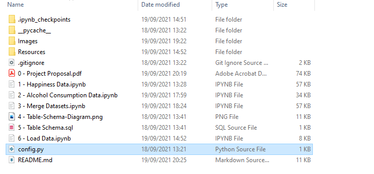
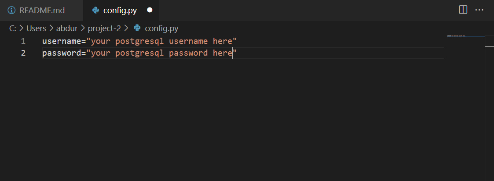

# Project #2 - Extract, Transform, and Load

## Contents
* [Project Proposal](#proposal):
*    1. [Project Outline](#outline)
*    2. [Data Sources](#sources)
*    3. [Final Production Database](#final-production-db)
*    4. [Findings](#findings)

* [Project Report](#report):
*    1. [Extract](#extract)
*    2. [Transform](#transform)
        1. [Happiness Data](#happiness-data)
        2. [Alcohol Consumption Data](#alcohol-data)
*    3. [Load](#load)
* [How to Run / Main Working Files](#main)
* [Dependencies](#dependencies)
*   1. [Environment](#environment)
*   2. [Modules](#modules)
*   3. [Config password file](#config)
* [Software Used](#software)
* [Team - Roles](#team)

## Project Proposal:

For the complete proposal report please refer to:\
[Project Proposal](0%20-%20Project%20Proposal.pdf) PDF File.

### Project Outline
One might argue that people are momentarily happier when drinking alcohol -- but that over more extended periods, drinking more does not make them more satisfied with life. As such, the industry we have focused on is healthcare. 

This project is an attempt to extract, transform and load a final dataset that can address questions behind how the use of alcohol impacts the happiness of nations around the globe.

### Data Sources
We needed 2 data sets:

1. [Alcohol Consumption Data](https://www.who.int/data/gho/data/indicators/indicator-details/GHO/total-(recorded-unrecorded)-alcohol-per-capita-(15-)-consumption) -
(ref: World Health Organisation - Alcohol, total per capita (15+) consumption (in litres of pure alcohol) (SDG Indicator 3.5.2))

A dataset with alcohol consumed per person on average for each country.

2. [World Happiness Report](https://www.kaggle.com/mathurinache/world-happiness-report) - (ref: Kaggle.com - World Happiness Report up to 2020)

A dataset with Happiness metrics, such as GDP per capita, Healthy Life Expecatancy and a Happiness score. 

These data sets were downloaded as CSV files and stored in the Input folder ([Resources/Input](Resources/Input))

There are 3 files in this folder:
1. WHO-alcohol-data.csv
2. 2015.csv (Happiness data for 2015)
3. 2019.csv (Happiness data for 2019)

### Final Production Database
For the final data both a Relational Database such as SQL or a Non-Relational database such as Mongo DB, could have been used.

We chose to load the data into a PostgreSQL database which is a Relational Database.

The reason for using a Relational Database is because they are better suited to our purpose due to the ability to write complex SQL queries for data analysis and reporting.

### Findings
The resulting dataset can be used for future analysis to determine if alcohol consumption can predict happiness score, GDP per capita or healthy life expectancy. 

More detailed findings in the [Proposal report](#proposal)

Project Report

* Detailed step by step guide of all Extract, Transform and Load steps undertaken can be found here: [Technical Steps](/Techincal%20Steps/Technical.md)

## How to Run / Main Working Files
* Table Schema is stored in [/Table Schema](/Table%20Schema) folder.
* Use the Table Schema.sql file to create a Tables in Postgres Database.

* The root([/Notebooks](/Notebooks)) folder contains all the main working files. They should opened and run in the numerical order assigned i.e. from 1 to 4.

    * 0 - Project Proposal.pdf - Jupyter notebook: Extraction and Transformation process of the Happiness Data
    * 1 - Happiness Data.ipynb - Jupyter notebook: Extraction and Transformation process of the Happiness Data
    * 2 - Alcohol Consumption Data.ipynb - Jupyter notebook: Extraction and Transformation process of the Alcohol Data
    * 3 - Merge Datasets.ipynb - Jupyter Notebook: Dataset Merge of Transformed Alcohol Consumption and Happiness Data
    * 4 - Load Data.ipynb - Jupyter Notebook: Importing and Loading Merged Data into PostgreSQL database table.

## Dependencies
You will need a Python Environment.

Requirements.txt file in root directory contains all packaged used.
pipinstall -r requirements. txt

### Config password file
A Config.py file containing the user and password of your PostgreSQL server must be created and stored in the root folder.

This file has been added to the Repository .gitignore file so it is not uploaded/pushed to the repository.

Create a config .py file in the root folder.

Inside the config .py file, enter your username and password as in the image:

## Software Used
* [PgAdmin](https://www.pgadmin.org/)
* [QuickDBD](https://www.quickdatabasediagrams.com/)

Using pgAdmin, You will need to create a PostgreSQL Database called "alcohol_vs" (without the quotes).

## Team - Roles

Although each person worked primarily on their allocated task, all steps were reviewed and completed as a team effort.

* [Elena Dragomir](https://github.com/elliedragomir)
    * Primary task: Project Outline and Proposal and Finding Datasets
    * Secondary task: ETL (Extract, Transform, Load) Process.

* [Mini Yadav](https://github.com/Miniy751) 
    * Primary task: ETL (Extract, Transform, Load) Process
    * Secondary task: Finding Datasets

* [Abdurrahman Raja](https://github.com/Abzraja)
    * Primary task: PostgreSQL Table Schema, PostgreSQL Table Creation and README.
    * Secondary task: ETL (Extract, Transform, Load) Process