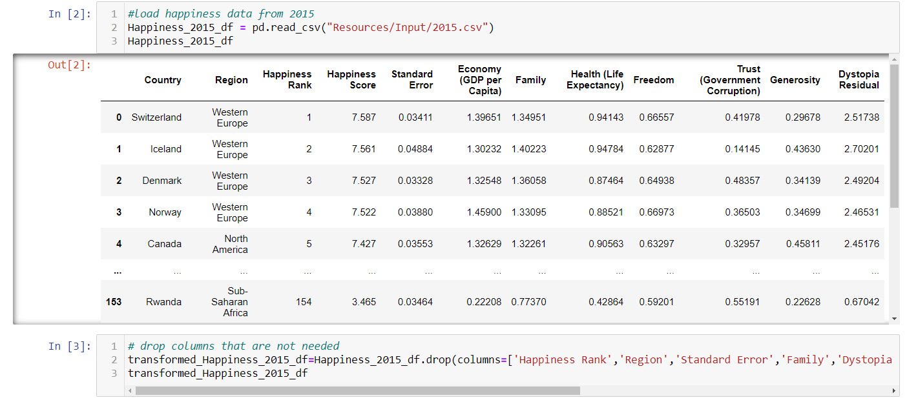
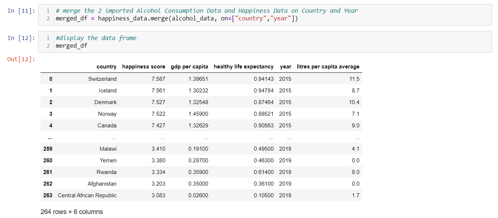

# Project #2 - Extract, Transform, and Load

## Contents
* [Project Proposal](#proposal):
*    1. [Project Outline](#outline)
*    2. [Data Sources](#sources)
*    3. [Final Production Database](#final-production-db)
*    4. [Findings](#findings)

* [Project Report](#report):
*    1. [Extract](#extract)
*    2. [Transform](#transform)
        1. [Happiness Data](#happiness-data)
        2. [Alcohol Consumption Data](#alcohol-data)
*    3. [Load](#load)

* [Repository Structure](#repo)
* [Main Working Files](#main)
* [Dependencies](#dependencies)
*   1. [Environment](#environment)
*   2. [Modules](#modules)
*   3. [Config password file](#config)
* [Software Used](#software)
* [Team - Roles](#team)

## Project Proposal:

For the complete proposal report please refer to:\n
[Project Proposal](0 - Project Proposal.pdf) PDF File.

### Project Outline
One might argue that people are momentarily happier when drinking alcohol -- but that over more extended periods, drinking more does not make them more satisfied with life. As such, the industry we have focused on is healthcare. 

This project is an attempt to extract, transform and load a final dataset that can address questions behind how the use of alcohol impacts the happiness of nations around the globe.

### Data Sources
We needed 2 data sets:

1. [Alcohol Consumption Data](https://www.who.int/data/gho/data/indicators/indicator-details/GHO/total-(recorded-unrecorded)-alcohol-per-capita-(15-)-consumption) -
(ref: World Health Organisation - Alcohol, total per capita (15+) consumption (in litres of pure alcohol) (SDG Indicator 3.5.2))

A dataset with alcohol consumed per person on average for each country.

2. [World Happiness Report]() - (ref: Kaggle.com - World Happiness Report up to 2020)

A dataset with Happiness metrics, such as GDP per capita, Healthy Life Expecatancy and a Happiness score. 

These data sets were downloaded as CSV files and stored in the Input folder ([Resources/Input](Resources/Input))

There are 3 files in this folder:
1. WHO-alcohol-data.csv
2. 2015.csv (Happiness data for 2015)
3. 2019.csv (Happiness data for 2019)

### Final Production Database
For the final data both a Relational Database such as SQL or a Non-Relational database such as Mongo DB, could have been used.

We chose to load the data into a PostgreSQL database which is a Relational Database.

The reason for using a Relational Database is because they are better suited to our purpose due to the ability to write complex SQL queries for data analysis and reporting.

### Findings
The resulting dataset can be used for future analysis to determine if alcohol consumption can predict happiness score, GDP per capita or healthy life expectancy. 

## Project Report:

### Extract
The original Data Sources used are outlined above in the Data Sources section.

The files are contained in the Input directory.

These CSV files were loaded into Pandas Dataframes by using the pd.read_csv Pandas function using Jupyter Notebook.

### Transform

#### Happiness Data

To transform the data we needed to first analyse the data and select which data we needed.

Then we dropped any columns we did not require using the dataframe.drop fuction in Pandas.

We dropped columns that we deemed should not directly be related to Alcohol Consumption.

The remaining columns were renamed for readability and consistency. The Happiness Data has 2 separate CSV files that need to be concatenated together. In order to do this, both dataframes must have matching column names.

A column was added to designate the Year the data is for

The above steps were repeated for the 2019 Happiness Data.

Then finally the data was concatenated into a single dataframe and exported to a CSV file.

#### Alcohol Consumption Data

The downloaded file was imported into Pandas

Columns that were not required were dropped.

Columns were renamed for consistency between this data and the Happiness Data.

This dataset only contained records for the Years 2000, 2005, 2010, 2015 and 2019 and the not the Years in between. Our Happiness Data contained Year 2015-2019. The only years we can match are 2015 and 2019, therefore we filtered the data to only include values for these 2 years.

The litres per capita column had a strange format with the average figure followed by a range in brackets (e.g. 9.6[8-11.1])

We only wanted the average figure that was before the brackets.

So we used a function to strip this data out into a new column.

Then the undesired column with brackets was dropped.

Finally numerical columns had their data type set to numeric instead of object. This was checked and then the dataframe was exported to a CSV.

Next, both Data sets were loaded into a single Notebook file.

When imported a new Unnamed:0 Column had appeared in each dataframe, so this had to be dropped.

The country was set as the index for the alcohol consumption data.

Both dataframes were then merged on the Year and Country columns

The columns were re-ordered in a way we wanted to present the data.

The data was checked for any missing values

The country was set as the index.

The columns were renamed, replacing spaces with underscores, for the purpose of matching the Table Field names in PostgreSQL.

The data was rearraned in a way we wanted to present it. By sorting litres per capita average in most to least (descending order).

And finally the dataframe was exported to a CSV file.

### Load

A Table Schema reflecting our final dataframe was created using QuickDBD.

This was used to export a [PostgreSQL Table Schema](5%20-%20Table%20Schema.sql) .sql file.

PgAdmin was used to create a Database and the code from the Table Schema SQL file was used a Query to create the table.

A Query was run to make sure the table had been created correctly.

The final merged data was imported into a DataFrame in a new Notebook.

For this step the SQlAlchemy module was also imported and also a Config file with the username and password of the PostgreSQL server and database is stored. This was done so the username and password is not leaked when uploaded to the repository.

A connetion to the database was established and then an inspect command was run to see if the table was visible to verify the connection.

The to_sql function was used to load the dataframe contents to the PostgreSQL table.

Finally a Query was run on the database using pgAdmin to verify the data had loaded into the table.

## Respository Structure
* Root folder([/](/))  - Contains Main Notebook files and Table Schema files. These files have been prefixed with a number to designate the order they were completed and run.

* Images Folder ([Images/](Images/)) - Contains image files used in README.

* Resources Folder ([Resources](Resources/)) - Contains Input and Output Folders.
    * [Resources/Input](Resources/Input) - Contains original data from downloaded data sets, in the form of CSV files.
    * [Resources/Output](Resources/Output) - Contains data that has been transformed, in the form of CSV files.

## Main Working Files

* The root([/](/)) folder contains all the main working files.
    * The files are numbered in the order they were created and run.
    
    * 1 - Happiness Data.ipynb - Jupyter notebook: Extraction and Transformation process of the Happiness Data
    * 2 - Alcohol Consumption Data.ipynb - Jupyter notebook: Extraction and Transformation process of the Alcohol Data
    * 3 - Merge Datasets.ipynb - Jupyter Notebook: Dataset Merge of Transformed Alcohol Consumption and Happiness Data
    * 4 - Table-Schema-Diagram.png - Image File: Table Schema Diagram from QuickDBD
    * 5 - Table Schema.sql - SQL File: SQL code to create PostgreSQL Table
    * 6 - Load Data.ipynb - Jupyter Notebook: Importing and Loading Merged Data into PostgreSQL database table.

## Dependencies
### Python Environment and Package Mananger
* [Anaconda](https://www.anaconda.com/products/individual)

### Modules

You can use conda or pip to install the packages below

e.g. `pip install Pandas`\
e.g. `conda install Pandas`

* [Jupyter Notebook](https://jupyter.org/install.html)
* [Pandas](https://pypi.org/project/pandas/)
* [SQLAlchemy](https://pypi.org/project/SQLAlchemy/)
* [Psycopg2](https://pypi.org/project/psycopg2/)

### Config password file

## Software Used
* [PgAdmin](https://www.pgadmin.org/)

## Team - Roles

Although each person worked primarily on their allocated task, all steps were reviewed and completed as a team effort.

* [Elena Dragomir](https://github.com/elliedragomir)
    * Primary task: Project Outline and Proposal and Finding Datasets
    * Secondary task: ETL (Extract, Transform, Load) Process.

* [Mini Yadav](https://github.com/Miniy751) 
    * Primary task: ETL (Extract, Transform, Load) Process
    * Secondary task: Finding Datasets

* [Abdurrahman Raja](https://github.com/Abzraja)
    * Primary task: PostgreSQL Table Schema, PostgreSQL Table Creation and README.
    * Secondary task: ETL (Extract, Transform, Load) Process