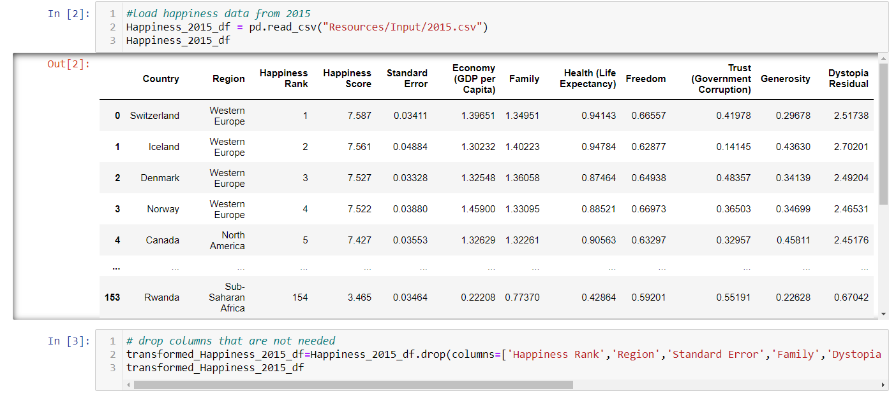

## Project Report:

### Extract
The original Data Sources used are outlined above in the [Data Sources](#sources) section.

The files are contained in the Resources/Input directory.

Using [Jupyter Notebook](#notebook):

These CSV files were loaded into [Pandas](#pandas) Dataframes by using the pd.read_csv Pandas function using Jupyter Notebook.

### Transform

#### Happiness Data

To transform the data we needed to first analyse the data and select which data we needed.

Then we dropped any columns we did not require using the dataframe.drop fuction in Pandas.

We dropped columns that we deemed should not directly be related to Alcohol Consumption.

The remaining columns were renamed for readability and consistency. The Happiness Data has 2 separate CSV files that need to be concatenated together. In order to do this, both dataframes must have matching column names.

A column was added to designate the Year the data is for

The above steps were repeated for the 2019 Happiness Data.

Then finally the data was concatenated into a single dataframe and exported to a CSV file.

#### Alcohol Consumption Data

The downloaded file was imported into Pandas

Columns that were not required were dropped.

Columns were renamed for consistency between this data and the Happiness Data.

This dataset only contained records for the Years 2000, 2005, 2010, 2015 and 2019 and the not the Years in between. Our Happiness Data contained Year 2015-2019. The only years we can match are 2015 and 2019, therefore we filtered the data to only include values for these 2 years.

The litres per capita column had a strange format with the average figure followed by a range in brackets (e.g. 9.6[8-11.1])

We only wanted the average figure that was before the brackets.

So we used a function to strip this data out into a new column.

Then the undesired column with brackets was dropped.

Finally numerical columns had their data type set to numeric instead of object. This was checked and then the dataframe was exported to a CSV.

Next, both Data sets were loaded into a single Notebook file.

When imported a new Unnamed:0 Column had appeared in each dataframe, so this had to be dropped.

The country was set as the index for the alcohol consumption data.

Both dataframes were then merged on the Year and Country columns

The columns were re-ordered in a way we wanted to present the data.

The data was checked for any missing values

The country was set as the index.

The columns were renamed, replacing spaces with underscores, for the purpose of matching the Table Field names in PostgreSQL.

The data was rearraned in a way we wanted to present it. By sorting litres per capita average in most to least (descending order).

And finally the dataframe was exported to a CSV file.

### Load

A Table Schema reflecting our final dataframe was created using [QuickDBD](#quickdbd).

This was used to export a [PostgreSQL Table Schema](5%20-%20Table%20Schema.sql) .sql file.

[PgAdmin](#pgadmin) was used to create a Database and the code from the Table Schema SQL file was used a Query to create the table.

A Query was run to make sure the table had been created correctly.

The final merged data was imported into a DataFrame in a new Notebook.

For this step the [SQlAlchemy](#sqlalchemy) module was also imported and also a [Config](#config) file with the username and password of the PostgreSQL server and database is stored. This was done so the username and password is not leaked when uploaded to the repository.

A connetion to the database was established and then an inspect command was run to see if the table was visible to verify the connection.

The to_sql function was used to load the dataframe contents to the PostgreSQL table.

Finally a Query was run on the database using pgAdmin to verify the data had loaded into the table.

